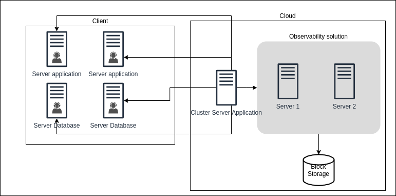
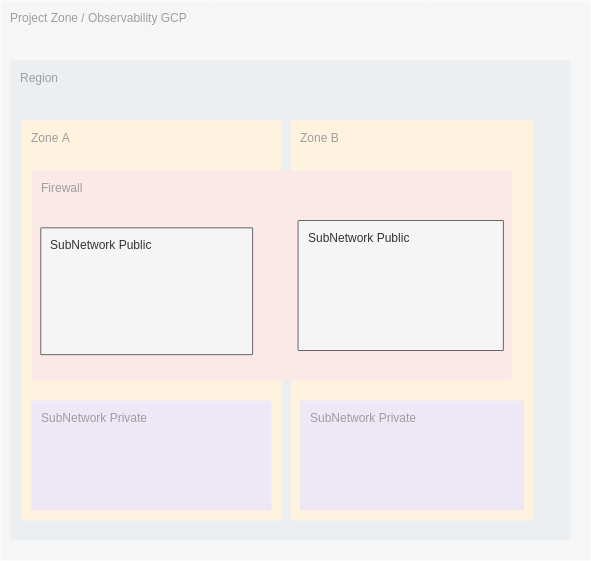

# Projeto Observabilidade

- [Quadro Kanban do Projeto Observabilidade](https://github.com/orgs/mentoriaiac/projects/4)

## Motivação

Hoje o projeto [Dados Abertos de Feira](https://www.dadosabertosdefeira.com.br) necessita de uma estrutura de análise de logs e métricas do servidor que hoje ele roda.

## Objetivo

Termos uma estrutura gerenciada pela MentoriaIaC que irá prover os [pilares da observabilidade](https://devopsdays.org/events/2019-porto-alegre/program/izael-ffemberg) para projetos parceiros como o **Dados Abertos de Feira**.

Para este objetivo temoas a possibilidade de subir uma estrutura de observabilidade “paga” (Newrelic, DataDog, Istana.. etc), porém escolhemos gerenciar a própria estrutura para termos a oportunidade de:

- Desenhar e modelar um projeto que poderá atender vários clientes
- Desenvolver e manter uma estrutura na nuvem
- Experimentar e validar hipóteses de solução
- Fornecer uma solução opinativa de observabilidade

## Quais estruturas são necessárias

- Um ambiente onde essa infra irá rodar (GCP inicialmente)
- Automação genérica que possa ser replicada em ambiente de desenvolvimento, homologação e produção.
  - Essa automação genérica permite que os membros da MentoriaIaC ou outras pessoas possam validar a solução em um ambiente pessoal.
- Implementação da automação
- Alinhamento de quando e/ou como abrir a solicitação de mudança (Pull Request) com o projeto cliente para implementação da solução

## Épicos

- Criar organization no GCP e habilitar o free tier
- Criar automação para infraestrutura básica (groundwork) ([Issue-2 mentoriaiac/iac](https://github.com/mentoriaiac/iac/issues/2))
- Subir infra básica em um projeto no GCP
- Criar automação para rodar o orquestrador de containers ([k8s](https://kubernetes.io/pt-br/), [Nomad](https://www.nomadproject.io/))
  - Escolher qual ou quais orquestradores utilizar
  - Definir requerimentos do orquestrador
  - Criar a automação
- Subir orquestrador no projeto no GCP
- Criar automação para o cluster consul
- Subir o consul
- Criar automação para o Loki
- Subir Loki em cima da orquestração
- Planejar (desenho) qual vai ser a solução de Observabilidade que iremos adotar
  - [OpenTelemetry](https://opentelemetry.io/)?
- Iniciar implementação da primeira parte da solução de Observabilidade (um dos pilares - Logs)
  - Desenho
  - Automação
  - Implementação
- Alinhamento com o cliente para implementar a solução
- Implementação no cliente
- Planejar como será a interface que o cliente irá ter com o projeto

## Componentes

### Consul

Pensamos inicialmente em ter um cluster consul para ele ser o nosso inventário (um ponto de controle de tudo que sobe e se acopla no ambiente).

## Desenho inicial

## Infra básica de rede superficial

## Desenho da arquitetura do cluster consul

## Contribuindo com o projeto

Para contribuir com o projeto pode criar uma nova Issue para levantar uma discussão, ou criar um novo Pull Request com a sugestão de modificação e/ou melhoria.
